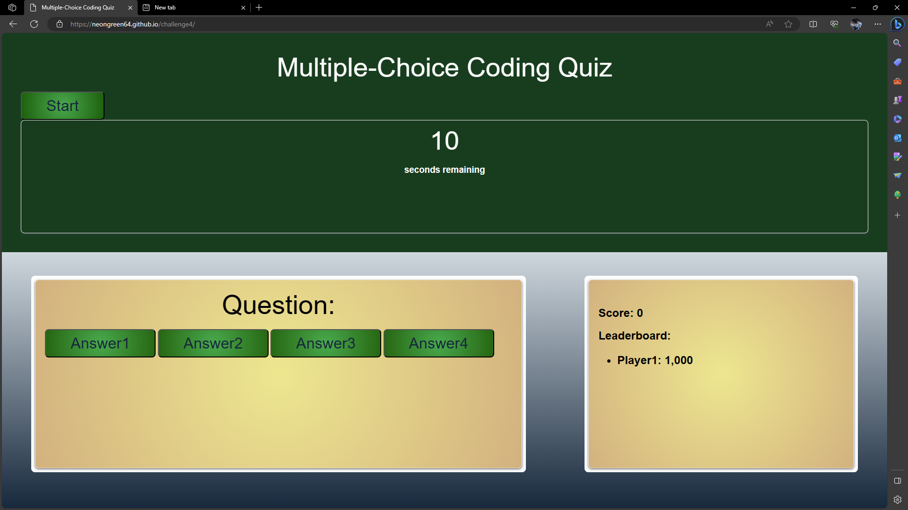

<h1>Description</h1>

This javascript application was created to quiz the user on their knowledge of javascript.

<h1>Usage</h1>
Steps to use my Javascript quiz:
1. Click start.
2. You have 15 seconds to answer as many questions as possible(correct +100  incorrect -100).
3. Answer if you would like to include lowercase, uppercase, special characters, or numbers.

<h1>Application</h1>
https://neongreen64.github.io/challenge4/

<h1>License</h1>

Please refer to the LICENSE in the repo.

